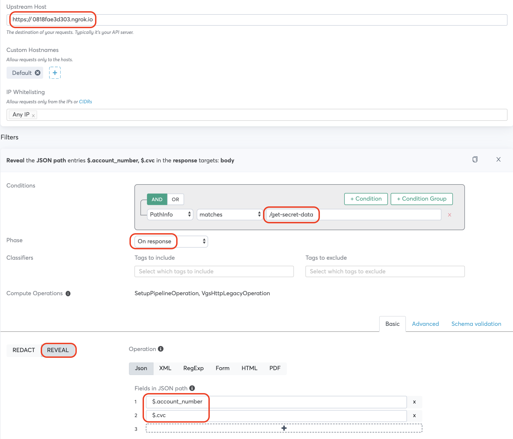
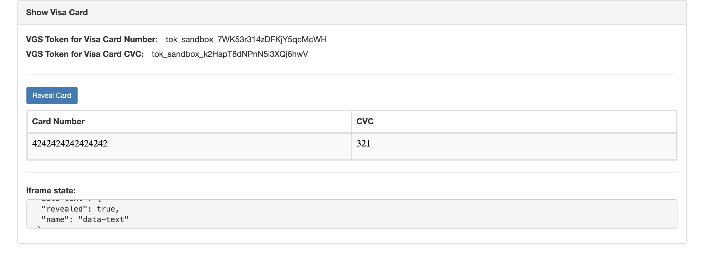

<p align="center"><a href="https://www.verygoodsecurity.com/"></a></p>
<p align="center"><b>VGS Show with Customer API for Authentication</b></p>

# Instructions
This app demonstrates how customer API integrates with VGS Show iframe.     

## Requirements
* Spring Boot
* Ngrok
* Dashboard Access

## Backend API Implementation
The purpose of customer API is to authenticate the VGS Show request. If it is valid user, the API echos the request payload back, otherwise it would give 403 authentication error.
This example is just doing simple fake authentication. In reality customer can use any API authentication method as they like, such as JWT, Basic Auth etc.

```java
@RestController
public class GetSecretController {

    @PostMapping(path="/get-secret-data", consumes = "application/json", produces = "application/json")
    public ResponseEntity<Object> getSecret(@RequestBody String requestBody, @RequestHeader(value="X-ACCESS-TOKEN") String accessToken) {
        if(accessToken.equals("YWRtaW46cGFzc3dvcmQ=")) { // Fake Authentication
            return ResponseEntity.ok(requestBody);
        }
        else {
            return new ResponseEntity<>("Failed to authenticate token", HttpStatus.FORBIDDEN);
        }

    }
}
```

## Frontend Impelmentation
Check the code in `/src/main/resources/static/index.html`      

The code below would initiate POST requests to backend API endpoint `/get-secret-data` with paylaod and headers specified. 
```javascript
  const button = document.getElementById('reveal-btn');

  button.addEventListener('click', function() {
    const show = VGSShow.create('tntxqudwikg', function(state) {
      document.getElementById('state').innerText = JSON.stringify(state, null, ' '); 
    });
 
    const iframe_cc = show.request({
      name: 'data-text',
      method: 'POST',
      path: '/get-secret-data',
      headers: {'X-Access-Token': 'YWRtaW46cGFzc3dvcmQ='}, // base64 encoded username:password
      payload: {'json': {'account_number': 'tok_sandbox_7WK53r314zDFKjY5qcMcWH'}},
      htmlWrapper: 'text',
      jsonPathSelector: 'json.account_number'
    });

    const iframe_cvc = show.request({
      name: 'data-text',
      method: 'POST',
      path: '/get-secret-data',
      headers: {'X-Access-Token': 'YWRtaW46cGFzc3dvcmQ='}, // base64 encoded username:password
      payload: {'json': {'cvc': 'tok_sandbox_k2HapT8dNPnN5i3XQj6hwV'}},
      htmlWrapper: 'text',
      jsonPathSelector: 'json.cvc'
    });
    
    iframe_cc.render('#revealed-card-number');
    iframe_cvc.render('#revealed-card-cvc');
  });
 ``` 

There should be html element to render the iframe generated above.
```html
                  <td id="revealed-card-number" ><!--VGS Show.js iframe for card number will be here!--></td>
                  <td id="revealed-card-cvc"><!--VGS Show.js iframe for card cvc will be here!--></td>
```

## Run App
```
./mvnw spring-boot:run
```

## Run Ngrok
```
./ngrok http 8080
```

## VGS Dashboard Route Config



## Demo

After running ngrok, open `https://{NgrokID}.ngrok.io/index.html`     
Click 'Reveal Card' button, you will see VGS Show iframe is loaded with original card data.



